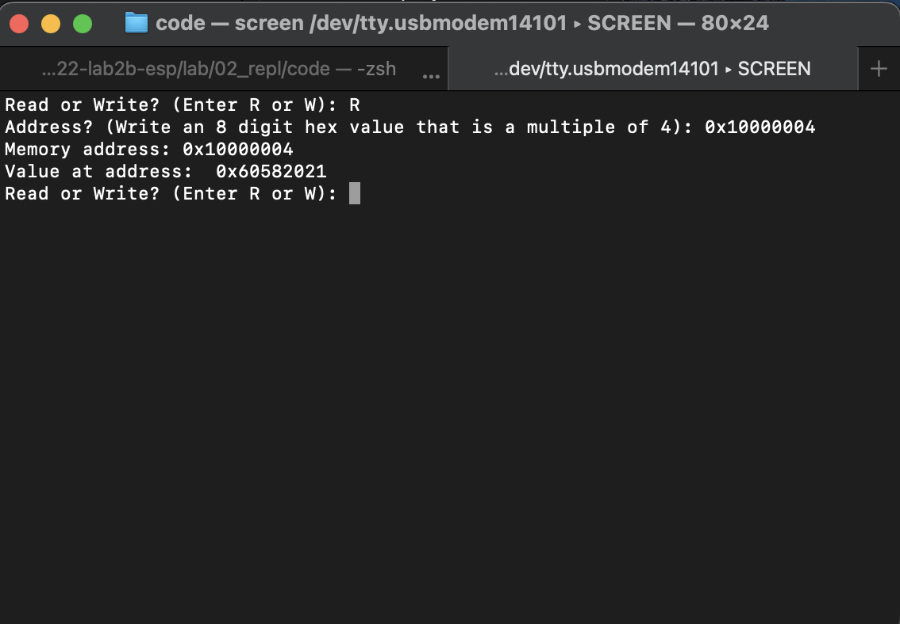
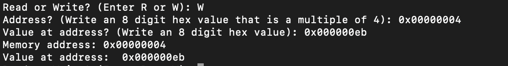

### Overview:

An REPL asks the user for a READ or WRITE action. If the user types in R, the program requests a hex memory address to read from and returns its value. If user types in W, the program requests a hex memory address and a value to write to said address, before returning the newly updated address value.

