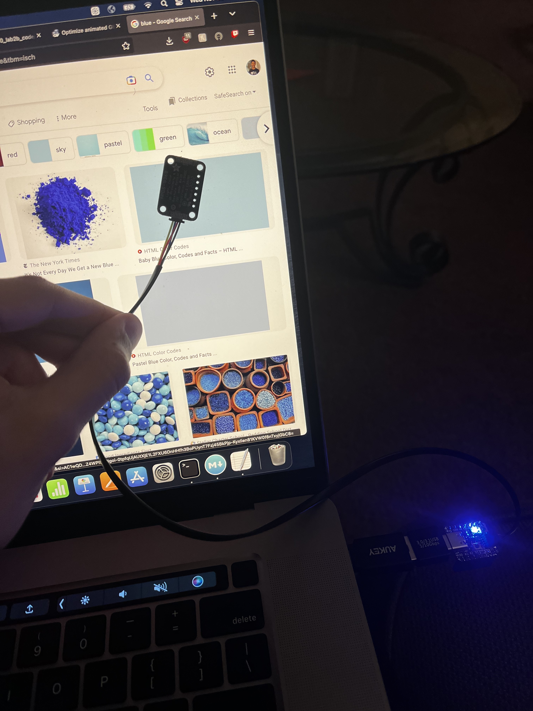
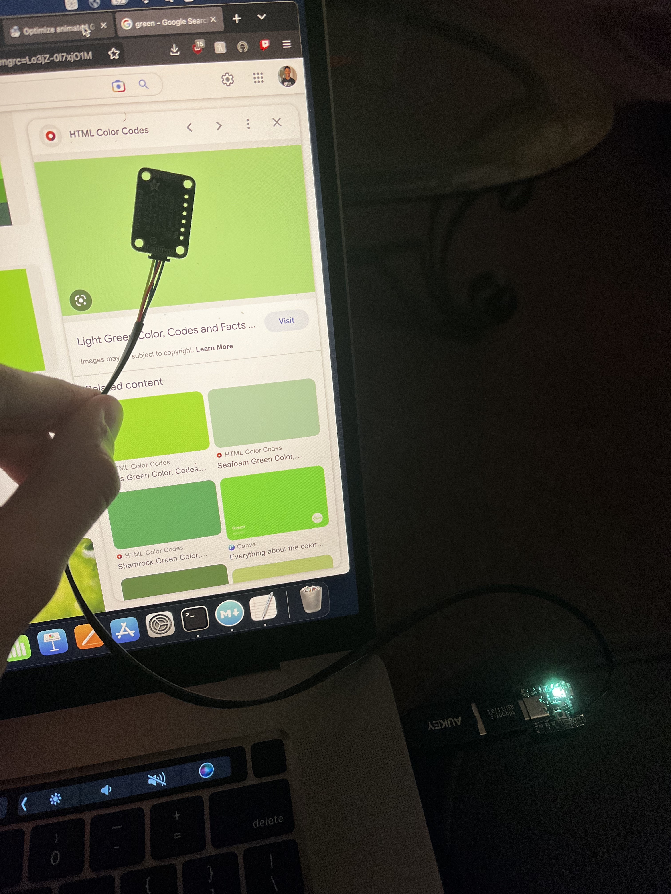

### Overview:

Same as part 8, except now the code reads the color that the ADPS9960 sensor detects, and converts it into a single integer to set the neopixel color register as well as the brightness of the LED.

